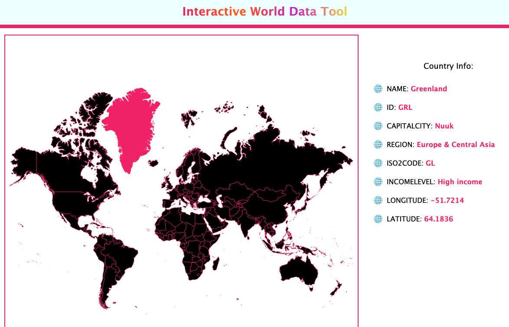

# WorldMapTask 🌐

### 1. Project Description

Thinking, thinking..... and ChatGPT comes to the rescue again!
"Discover the world at your fingertips with our interactive world map, complete with essential country data. Whether you're a globetrotter planning your next expedition or a student exploring geography, our map offers a wealth of information. Easily explore continents and countries with our user-friendly interface."

This project was generated with [Angular CLI](https://github.com/angular/angular-cli) version 18.0.4. It pulls data from the World Bank API using a simple url, e.g., 'https://api.worldbank.org/v2/country/au?format=json' and does not require an API key.

### 2. Installation Instructions

If you would like to run this application, you'll need to:

* Fork the Respository
* Clone to your local environment
* Run `npm install` in your command line to generate the node modules directory

## Development server

Run `ng serve -o` for a dev server that automatically opens a new browser tab on `http://localhost:4200/`. The application will automatically reload if you change any of the source files.

## Code scaffolding

Run `ng g c component-name` to generate a new component. You can also use `ng generate directive|pipe|service|class|guard|interface|enum|module`.

## Build

Run `ng build` to build the project. The build artifacts will be stored in the `dist/` directory.

## Further help

To get more help on the Angular CLI use `ng help` or go check out the [Angular CLI Overview and Command Reference](https://angular.dev/tools/cli) page.

### 3. Feedback and Contributions

If you would like to contribute to this cute li'l project, please submit a pull request. 

  

